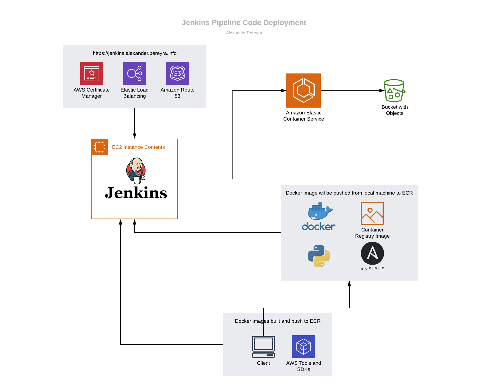

# jenkins-pipeline-deployment
this repo will serve as the master for a jenkins pipeline previously built for a code deployment. I will be documenting it so that it can be used by others




## prerequisites

- awscli configured for account you want to deploy resources to.
- docker installation and knowledge of how to use docker
- knowledge of jenkins

## build jenkins server

- AWS documentation for this build can be found in whitepapers so I won't be going into the details. See of commands below to build a baseline.
  - https://d1.awsstatic.com/Projects/P5505030/aws-project_Jenkins-build-server.pdf
  - https://d0.awsstatic.com/whitepapers/DevOps/Jenkins_on_AWS.pdf

- Build a amz linux
- ssh into your instance
```
ssh -i ~/.ssh/<your_key.pem> ec2-user@ec2<ip_of_ec2>.compute-1.amazonaws.com
```

- If your distro of linux does not have wget...you can download and install it to use commands below.
```
sudo yum install wget
```

- Now we can install and configure Jenkins
```
sudo yum update –y
sudo wget -O /etc/yum.repos.d/jenkins.repo http://pkg.jenkinsci.org/redhat/jenkins.repo
sudo rpm --import https://pkg.jenkins.io/redhat/jenkins.io.key
sudo yum install jenkins -y
sudo service jenkins start
```
- Head to the directory below and grab the admin password as you will need it in the next step.
```
sudo cat /var/lib/jenkins/secrets/initialAdminPassword
```

- Now you connect to the Jenkins interface via the servers public dns over port 8080 and use the admin password to connect.
```
http://<your_server_public_DNS>:8080
```

- That's it! Now that your Jenkins instance is up and running. We'll go setup a certificate and Route53 alias for a cleaner/secure url. This step is optional if you don't have a domain registar or don't require SSL.

## setup up docker image and ecr (setup assumes you have awscli to aws account)

- log into ecr to create and store docker image.
```
aws ecr get-login
aws ecr create-repository --repository-name <your_repository_name>
aws ecr describe-repositories
aws ecr list-images --repository-name <your_repository_name>
```

- we are going to use an nginx image as an example here, but you can pull whichever image needed for your project
```
docker pull nginx:1.9
docker tag nginx:1.9 <your_aws_account_number>.dkr.ecr.us-east-1.amazonaws.com/ecs-test/nginx:1.9
docker push <your_aws_account_number>.dkr.ecr.us-east-1.amazonaws.com/ecs-test/nginx
aws ecr list-images --repository-name <your_repository_name>
```

## setup a cluster
```
aws ecs create-cluster --cluster-name <your_cluster_name>
aws ecs list-clusters
aws ecs describe-clusters --clusters <your_cluster_name>
aws ecs delete-cluster --cluster <your_cluster_name>
```

## setup bucket for ecs container configurations the cluster will use (you can also just use an existing bucket.)
- modify the files/ecs.config and files/copy-ecs-config-to-s3 files with your clusters name.
```
aws s3api create-bucket --bucket <bucket_name>
aws s3 cp files/ecs.config s3://<bucket_name>/ecs.config
aws s3 ls s3://<bucket_name>
```
- note that the bash 'copy-ecs-config-to-s3' file is used to copy the configuration for the container agent knows how to configure the cluster

## now we will create the ec2 instance the containers will run on
- cli command to create instance with specificed ami, profile, keyname, security group, and ecs config file
```
aws ec2 run-instances --image-id <ami_id> --count 1 --instance-type t2.micro --iam-instance-profile Name=ecsInstanceRole --key-name <keypair_name> --security-group-ids <security_group_id> --user-data file://copy-ecs-config-to-s3
aws ec2 describe-instance-status --instance-id <instance_id_from_output>
```

## setup task definitions
```
aws ecs register-task-definition --cli-input-json file://web-task-definition.json
aws ecs list-task-definition-families
aws ecs list-task-definitions
aws ecs describe-task-definition --task-definition web:1
aws ecs register-task-definition --cli-input-json file://web-task-definition.json
aws ecs list-task-definitions
aws ecs deregister-task-definition --task-definition web:2
aws ecs list-task-definitions
aws ecs register-task-definition help
aws ecs register-task-definition --generate-cli-skeleton
```

## scheduler. this is more for commands for testing if a scheduler is needed.
```
aws ecs create-service --cluster <cluster_name> --service-name web --task-definition web --desired-count 1
aws ecs list-services --cluster <cluster_name>
aws ecs describe-services --cluster <cluster_name> --services web
aws ec2 describe-instances --help
aws ec2 describe-instances --instance-ids <instance_id>
aws ecs update-service --cluster ecs-cluster-test --service web --task-definition web --desired-count 2
aws ecs describe-services --cluster <cluster_name> --services web
aws ecs update-service --cluster <cluster_name> --service web --task-definition web --desired-count 0
aws ecs delete-service --cluster <cluster_name> --service web
aws ecs list-services --cluster <cluster_name>
aws ecs create-service --generate-cli-skeleton
```

## starting tasks
```
aws ecs run-task --cluster <cluster_name> --task-definition web --count 1
aws ecs list-tasks --cluster <cluster_name>
aws ecs stop-task --cluster <cluster_name> --task <task_arn>
aws ecs list-tasks --cluster <cluster_name>
aws ecs list-container-instances --cluster <cluster_name>
aws ecs start-task --cluster <cluster_name> --task-definition web --container-instances <container_instance_arn>
aws ecs stop-task --cluster <cluster_name> --task <task_arn>
aws ecs stop-task --cluster <cluster_name> --task <task_arn>
```

## Task definitions
```
aws ecs register-task-definition --cli-input-json file://web-task-definition.json
aws ecs run-task --cluster <cluster_name> --task-definition web --count 1
aws ec2 describe-instance-status --instance-id <instance_id>
aws ecs list-tasks --cluster <cluster_name>
aws ecs list-container-instances --cluster <cluster_name>
aws ecs register-task-definition --cli-input-json file://web-task-definition.json
aws ecs run-task --cluster <cluster_name> --task-definition web --count 1
aws ecs register-task-definition --cli-input-json file://web-task-definition.json
aws ecs run-task --cluster <cluster_name> --task-definition web --count 1
```

## cleanup
```
aws ec2 terminate-instances --instance-ids <instance_id>
aws s3 rm s3://<bucket_name> --recursive
aws s3api delete-bucket --bucket <bucket_name>
aws ecr delete-repository --repository-name <ecr_repo_name> --force
```
- ensure task definitions are stopped if you get an error while deleting cluster
```
aws ecs delete-cluster --cluster <ecs_cluster_name>
```

## optional jenkins-codebuild via cloudformation templates

- Optionally, a jenkins/codebuild can be created and configured more easily via a cloudformation template.
- Reference: https://aws.amazon.com/blogs/devops/simplify-your-jenkins-builds-with-aws-codebuild/

- Updated Jenkins pipeline build from AWS DevOps Blog leveraging CodeDeploy in addition
- Reference https://aws.amazon.com/blogs/devops/setting-up-a-ci-cd-pipeline-by-integrating-jenkins-with-aws-codebuild-and-aws-codedeploy/

## cloudformation template for jenkins instance configured

- jenkins-instance.json is a cloudformation template to deploy just the jenkins instance with configuration.
- note that you will need to ssh into it to get initial admin password
- use command below to launch stack via commandline
```
aws cloudformation create-stack --capabilities CAPABILITY_IAM --parameters ParameterKey=JenkinsInstanceType,ParameterValue=t2.medium ParameterKey=KeyName,ParameterValue=<pem_key_here> ParameterKey=PublicSubnet1,ParameterValue=subnet-id-here>  ParameterKey=VpcId,ParameterValue=vpc-id-here> ParameterKey=YourIPRange,ParameterValue=<your_ip> --stack-name jenkins-instance --region us-east-1 --template-body file://jenkins-instance.json
```
- to delete stack after use
```
aws cloudformation delete-stack --stack-name jenkins-instance
```
